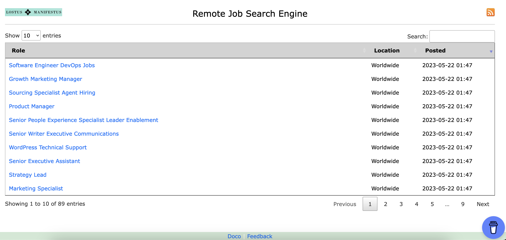

# Remote Jobs Search Engine

## 1. Overview
This is a free remote job search engine portal, that collects remote software jobs from various job sites and presents in one portal.

- scrapes different job sites in JOB_SITES, as per localenv.py.
- collects job details and stores it in local sqlite db.
- the portal presents data from sqlite db.
- the job-scraping script is run on a regular basis in the backend server, to refresh the jobs.
- you can subscribe to job updates via RSS subscription.
- deletes obsolete jobs that have been removed from the source sites.

## 2. Code Structure

- Application:
  - main app code is in app.py and other scripts in main directory for different use-cases.
  - [jobs_scraper](./jobs_scraper.py): runs job scraping from multiple sites, creates local sqlite db. This script also contains data extraction logic for the UI.
- templates: html templates.
- static: images, css and js code.

## 3. Pre-requisites
- Create a free sendinblue account and get your sendinblue API key from https://app.sendinblue.com/settings/keys/api.
- Use localenv.py.example as reference to create localenv.py and edit the values as you need:
```
cp localenv.py.example localenv.py
```

- Mandatory: Edit the value of APIKEY_SENDINBLUE:
```
APIKEY_SENDINBLUE="YOURSENDINBLUEAPIKEY"
```

- Mandatory: Edit the value of FLASK_SECRET_KEY:
```
FLASK_SECRET_KEY="ANYSECRET"
```

- Install application pre-req packages: ```pip3 install -r requirements.txt```
- Update email recipient details in [contactus.py](./contactus.py).

## 4. How to run
- Run [jobs_scraper](./jobs_scraper.py) and in the first-run, it will scrape job details as per your JOB_SITES config in localenv.py:
```
./jobs_scraper.py
```

- Run the UI app:
```
./app.py
```

OR

```
python3 app.py
```

- You should then be able to access the application via port 4015, http://localhost:4015/home/

## 4.1. Sample Run


## 5. Apache WSGI Setup
In a production environment, it is recommended to run a flask application via Apache or a similar application:
- Install and configure apache.
- Install the Apache WSGI module. In Debian, you can install it with the command ```apt-get install libapache2-mod-wsgi-py3```.
- [apache_flaskapp.conf.sample](apache_flaskapp.conf.sample): sample apache wsgi config to run this flask-app.
- All the 'print' messages in the app will go to Apache logs.
- Optional: You can authenticate users (not part of this app now), get Apache to pass the REMOTE_USER variable to the app, which can be shown in the UI.

## 6. Roadmap
[Roadmap](./roadmap.md)
